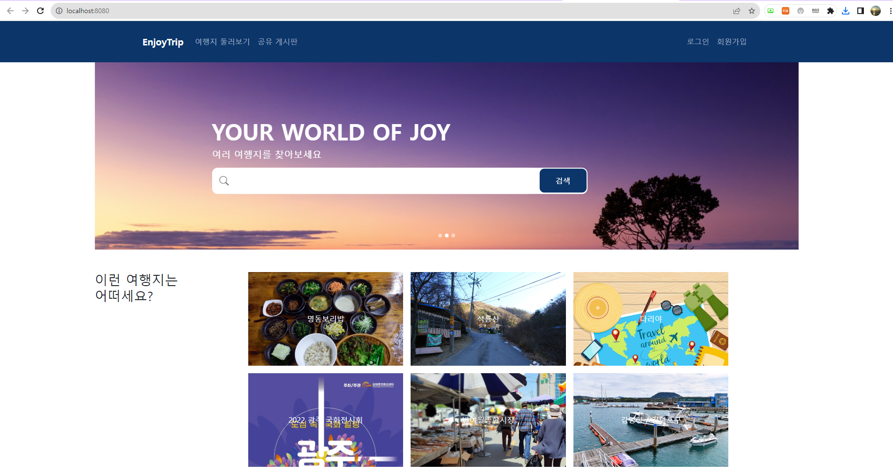
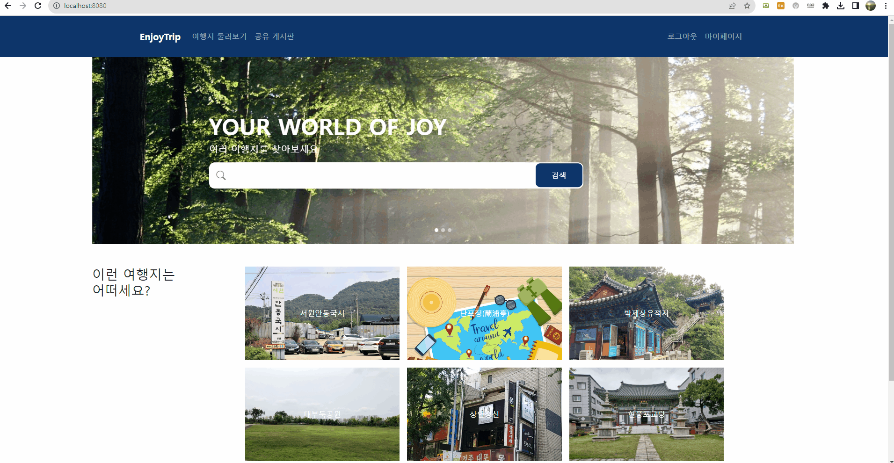
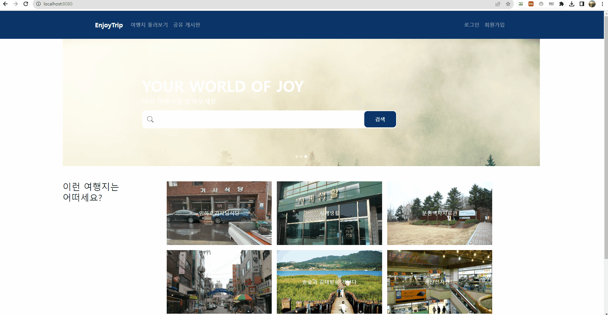
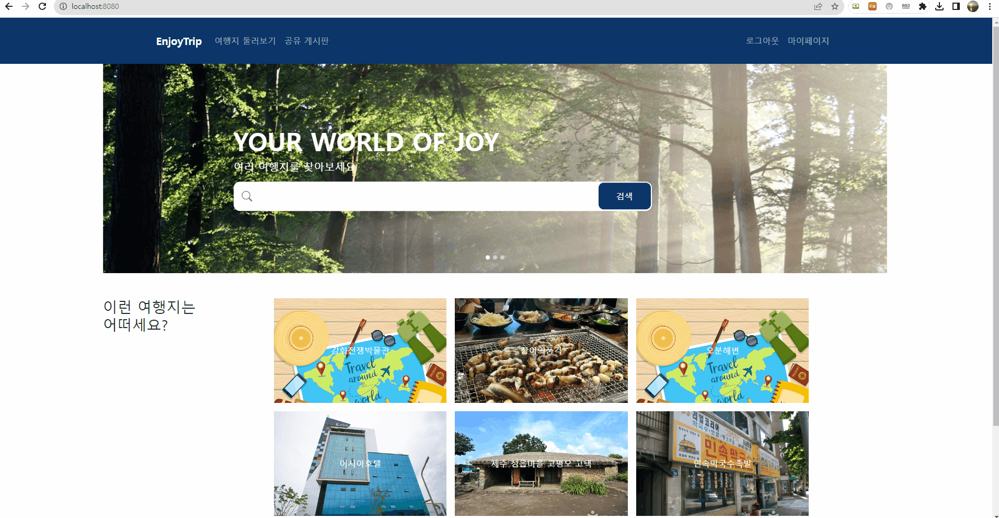

관통 프로젝트 제출 방법

# 관통프로젝트: TP_S10_S09_Framework_EnjoyTRip_홍길동_임꺽정 
### 제출일: 2024.11.03

### 참여 페어
- 김제영(조장), 김영욱

### 처리된 요구사항 목록
 
|난이도|구현기능|세부|작성여부(O/X)|
|:---:|---|---|:---:|
|기본|메인 페이지 및 메뉴 구성||O|
|기본|관광지 정보 조회|각 컨텐츠 별 5점|O|
|기본|회원관리 페이지|회원정보 등록, 수정, 삭제, 조회 화면|O|
|기본|로그인/로그아웃 페이지||O|
|추가|사이트맵/전체적인 메뉴 구성 화면||O|
|추가|나만의 여행 계획 페이지(팀별 아이디어)||X|
|심화|HtoPLace 관련 페이지(팀별 아이디어)||X|
|심화|게시판 페이지|글등록, 목록, 조회, 수정 화면|O|

* 작성된 기능은 반드시 캡쳐되어야 합니다. 
* 추가로 구현한 기능을 표에 추가시키세요.

### 실행화면 캡쳐 -
TODO: 요구사항 목록에서 완료 처리된 사항의 캡쳐 이미지를 등록하세요.
 

### 구현 기능: 메인 페이지 및 메뉴 구성

### 구현 기능: 로그인 및 로그아웃, 아이디 쿠키 저장 (Read, Cookie, Session)

### 구현 기능: 마이 페이지 및 회원 정보 수정 및 비밀번호 재확인 (Update)

  

### 구현 기능: 회원 가입 및 회원 탈퇴(Create, Delete)

  

### 구현 기능: 관광지 정보 조회

  
### 구현 기능: 사이트맵/전체적인 메뉴 구성 화면

